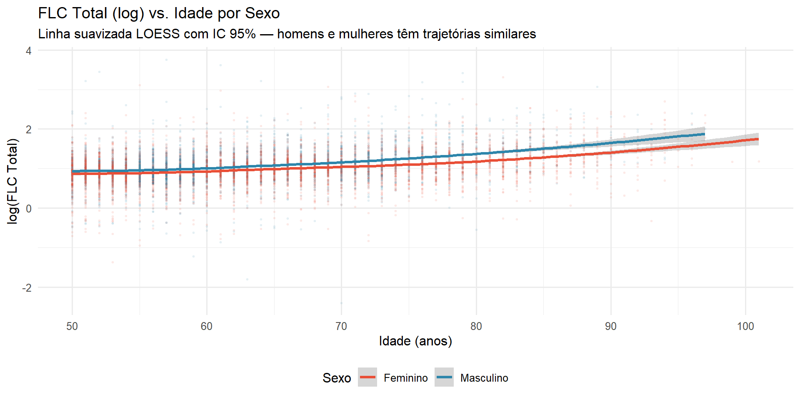
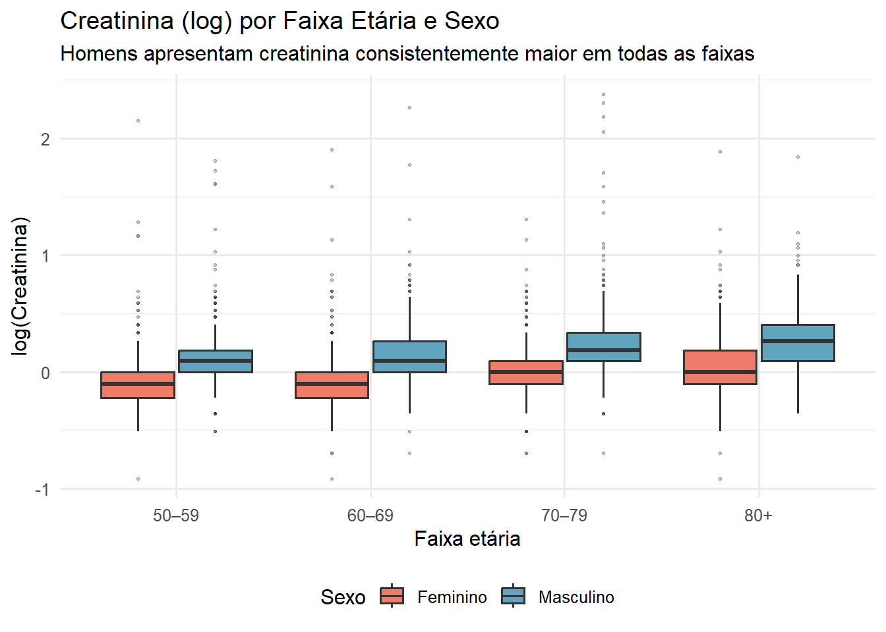
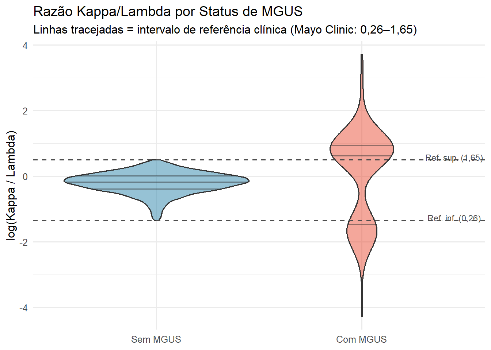
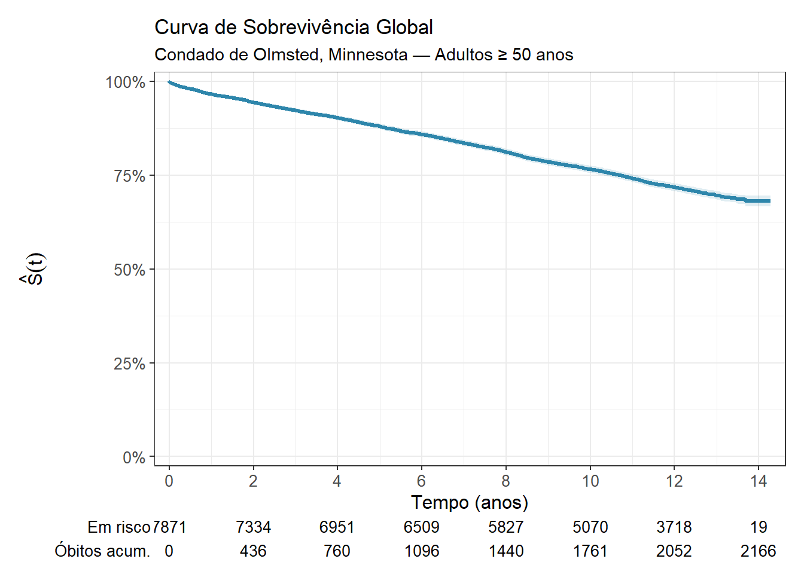

# Cadeia Leve Livre Sérica e Mortalidade por Todas as Causas

**Análise de Sobrevivência — Trabalho Final (2026/1)**  
DME / Instituto de Matemática — UFRJ

> **Autor:** Arthur Pontes Motta  
> **Professora:** Marina Silva Paez

---

## Relatório

[](https://arthurpmotta02.github.io/flc-survival-analysis/)

O relatório está disponível em formato interativo:

- **[Versão interativa](https://arthurpmotta02.github.io/flc-survival-analysis/)** — gráficos com código R expansível, tabelas completas e resultados inline (GitHub Pages)

---

## Sobre o trabalho

Análise estatística completa do conjunto de dados `flchain` (pacote `survival` do R), investigando a associação entre a concentração sérica de **cadeia leve livre (FLC)** e a mortalidade por todas as causas em adultos com 50 anos ou mais do Condado de Olmsted, Minnesota (EUA), a partir de um estudo de coorte de base populacional conduzido desde 1995.

**Pergunta de interesse:** A concentração sérica de cadeia leve livre está associada ao tempo de sobrevivência após controle por idade, sexo, creatinina sérica e diagnóstico de MGUS?

Os dados cobrem **7.871 indivíduos**, **2.166 óbitos** (27,5%) e até **14,3 anos** de seguimento. A covariável principal é o grupo de FLC total (decis 1–10 agrupados em quatro categorias: Baixo, Médio-baixo, Médio-alto e Alto).

---

## Estrutura do trabalho

| Seção | Conteúdo |
|-------|----------|
| **Introdução** | Contexto clínico da FLC; definições formais de $S(t)$, $h(t)$ e $H(t)$ |
| **Análise exploratória** | Tabela descritiva, distribuição do tempo, variáveis laboratoriais, causas de óbito, valores ausentes |
| **Kaplan-Meier** | Curva global, por grupo de FLC, sexo e faixa etária; tabela de $\hat{S}(t)$ em tempos fixos |
| **Nelson-Aalen** | Função de risco acumulada; diagnóstico de adequação distribucional |
| **Subgrupo MGUS** | Curvas KM e tabela por status de MGUS; discussão de viés de sobrevivência |
| **Seleção de covariáveis** | Procedimento de Collett (4 passos) + `stepAIC` + TRV sequencial |
| **Modelo de Cox** | Equação formal, HRs ajustados, forest plot, cinco diagnósticos (Schoenfeld, Martingale, dfbetas, Deviance, estatística C) |
| **Modelos paramétricos AFT** | 6 distribuições, AIC/BIC/LRT, parâmetro $Q$ da gama generalizada |

---

## Resultados principais

### Modelo de Cox

$$h(t \mid \mathbf{x}) = h_0(t)\exp\!\left(\boldsymbol{\beta}^\top\mathbf{x}\right)$$

| Covariável | HR | IC 95% |
|------------|----|--------|
| FLC Alto vs. Baixo | **2,04** | 1,73 – 2,40 |
| FLC Médio-alto vs. Baixo | 1,45 | 1,24 – 1,71 |
| FLC Médio-baixo vs. Baixo | 1,19 | 1,01 – 1,41 |
| Idade (por ano) | 1,10 | 1,10 – 1,11 |
| Sexo masculino | 1,23 | 1,11 – 1,35 |
| log(Creatinina) | 1,70 | 1,40 – 2,07 |
| MGUS | 1,25 | 0,76 – 2,07 |

Estatística $C$ de Harrell $= 0{,}788$

### Modelos Paramétricos AFT

$$\log T = \mathbf{x}^\top\boldsymbol{\beta} + \sigma\varepsilon$$

A **gama generalizada** foi selecionada (menor AIC; $\Delta$AIC $> 50$ para todos os demais). O parâmetro $\hat{Q} \approx 1{,}57$ (IC 95%: 1,38–1,75) rejeita formalmente log-normal ($Q = 0$) e Weibull ($Q = 1$). O grupo Alto reduz o tempo esperado de sobrevivência em aproximadamente 42% ($\exp(\hat{\beta}) \approx 0{,}58$).

| Distribuição | AIC | $\Delta$AIC |
|---|---|---|
| **Gama generalizada** | **15.267,73** | **0,00** |
| Weibull | 15.318,69 | 50,96 |
| Gama | 15.330,44 | 62,71 |
| Exponencial | 15.334,89 | 67,16 |
| Log-logística | 15.523,47 | 255,74 |
| Log-normal | 15.932,97 | 665,24 |

---

## Visualizações

### Análise Exploratória

**Distribuição do tempo de seguimento**


**Distribuição das variáveis laboratoriais**


**FLC total por grupo e taxa bruta de óbito**


**Causas de óbito por grupo de FLC**


**Perfil de recrutamento e valores ausentes**


**Idade e FLC por sexo**



**Creatinina por sexo e faixa etária**



**Razão kappa/lambda e MGUS**



**Correlação entre variáveis contínuas**


---

### Estimadores Não Paramétricos

**Kaplan-Meier global**



**Kaplan-Meier por grupo de FLC**


**Kaplan-Meier por sexo e faixa etária**


**Nelson-Aalen por grupo de FLC**


**Subgrupo MGUS**


---

### Modelagem

**Função de risco suavizada (pré-modelagem)**


**Gráficos de linearização (diagnóstico pré-ajuste)**


**Forest plot dos Hazard Ratios ajustados**


**Diagnóstico: proporcionalidade de riscos (Schoenfeld)**


**Diagnóstico: forma funcional (Martingale)**


**Diagnóstico: influência individual (dfbetas)**


**Diagnóstico: outliers (Deviance)**

![Resíduos de Deviance. Concentrados em $[-2{,}5;\;2{,}5]$; padrão assimétrico por desfecho é estrutural ao estimador.](figures/residuos-deviance-1.png)

**Curvas ajustadas pelo modelo de Cox**


**Verificação gráfica da gama generalizada (pós-ajuste)**


---

## Pacotes R utilizados

| Pacote | Função no trabalho |
|--------|--------------------|
| `survival` | KM, Nelson-Aalen, Cox, dados `flchain` |
| `flexsurv` | Modelos paramétricos AFT (gama generalizada, Weibull, etc.) |
| `bshazard` | Hazard suavizado por B-splines |
| `muhaz` | Hazard por kernel (referência) |
| `MASS` | `stepAIC` para seleção de covariáveis |
| `ggsurvfit` | Curvas KM/Nelson-Aalen com `ggplot2` |
| `survminer` | Diagnósticos do Cox (`ggcoxzph`, `ggforest`) |
| `gtsummary` | Tabelas descritivas e de modelos |
| `gt` | Tabelas com formatação e LaTeX |
| `tidyverse` | Manipulação e visualização |
| `patchwork` | Composição de gráficos em painéis |
| `broom` | Extração de resultados de modelos |
| `corrplot` | Matriz de correlação de Spearman |
| `scales` | Formatação de eixos |

---

## Arquivos

```
.
├── TrabalhoFinal_Sobrevivencia.qmd   # Documento-fonte (Quarto)
├── references.bib                    # 24 referências bibliográficas (ABNT)
├── figures/                          # Figuras geradas pelo render
│   ├── causas-obito-1.png
│   ├── correlacoes-1.png
│   ├── cox-curvas-1.png
│   ├── cox-ph-plot-1.png
│   ├── creat-sexo-idade-1.png
│   ├── dist-continuas-1.png
│   ├── flc-grupo-death-1.png
│   ├── flc-ratio-mgus-1.png
│   ├── forest-plot-1.png
│   ├── hazard-suavizado-1.png
│   ├── hist-futime-1.png
│   ├── idade-flc-sexo-1.png
│   ├── km-flc-1.png
│   ├── km-global-1.png
│   ├── km-sex-age-1.png
│   ├── lin-gengamma-1.png
│   ├── linearizacao-1.png
│   ├── missing-recrutamento-1.png
│   ├── nelson-aalen-1.png
│   ├── residuos-deviance-1.png
│   ├── residuos-dfbeta-1.png
│   ├── residuos-martingale-1.png
│   └── subgrupo-mgus-1.png
├── index.html                        # HTML publicado no GitHub Pages
└── README.md
```

---

## Reprodução local

### Dependências R

```r
install.packages(c(
  "survival", "flexsurv", "muhaz", "bshazard",
  "MASS", "My.stepwise", "ggsurvfit", "survminer",
  "gtsummary", "gt", "tidyverse", "patchwork",
  "broom", "corrplot", "scales"
))
```

> **R:** ≥ 4.4.0 · **Quarto:** ≥ 1.4

### Renderização

```bash
quarto render TrabalhoFinal_Sobrevivencia.qmd --to html
```

Os dados `flchain` são carregados diretamente via `data(flchain, package = "survival")` — nenhum arquivo externo necessário.

---

## Referências principais

- Dispenzieri, A. et al. Use of nonclonal serum immunoglobulin free light chains to predict overall survival in the general population. *Mayo Clinic Proceedings*, 87(6), 517–523, 2012.
- Kyle, R. A. et al. Prevalence of monoclonal gammopathy of undetermined significance. *New England Journal of Medicine*, 354(13), 1362–1369, 2006.
- Collett, D. *Modelling Survival Data in Medical Research*. 2. ed. CRC Press, 2003.
- Therneau, T. M.; Grambsch, P. M. *Modeling Survival Data: Extending the Cox Model*. Springer, 2000.
- Jackson, C. flexsurv: A Platform for Parametric Survival Modeling in R. *Journal of Statistical Software*, 70(8), 2016.
- Rebora, P.; Salim, A.; Reilly, M. bshazard: A Flexible Tool for Nonparametric Smoothing of the Hazard Function. *The R Journal*, 6(2), 114–122, 2014.
- Colosimo, E. A.; Giolo, S. R. *Análise de Sobrevivência Aplicada*. Edgard Blücher, 2006.
- Burnham, K. P.; Anderson, D. R. *Model Selection and Multimodel Inference*. 2. ed. Springer, 2002.
- Self, S. G.; Liang, K.-Y. Asymptotic properties of maximum likelihood estimators and likelihood ratio tests under nonstandard conditions. *JASA*, 82(398), 605–610, 1987.