# flc-survival-analysis

**Cadeia Leve Livre Sérica e Mortalidade por Todas as Causas**

> Disciplina: Análise de Sobrevivência (2026/1) — DME/IM-UFRJ  
> Autor: Arthur Pontes Motta  
> Professora: Marina Silva Paez

---

## Relatório interativo

O trabalho está publicado como página web com código expansível, gráficos e tabelas completas:

### **[https://arthurpmotta02.github.io/flc-survival-analysis/](https://arthurpmotta02.github.io/flc-survival-analysis/)**

---

## Sobre o trabalho

Análise estatística completa do conjunto de dados `flchain` (pacote `survival` do R), investigando a associação entre a concentração sérica de cadeia leve livre (FLC) e a mortalidade por todas as causas em adultos com 50 anos ou mais do Condado de Olmsted, Minnesota (EUA), a partir de um estudo de coorte de base populacional conduzido desde 1995.

**Pergunta de interesse:** A concentração sérica de cadeia leve livre está associada ao tempo de sobrevivência após controle por idade, sexo, creatinina sérica e diagnóstico de MGUS?

Os dados cobrem **7.871 indivíduos**, **2.166 óbitos** (27,5%) e até **14,3 anos** de seguimento. A covariável principal é o grupo de FLC total (decis 1–10 agrupados em quatro categorias: Baixo, Médio-baixo, Médio-alto e Alto).

---

## Estrutura do trabalho

| Seção | Conteúdo |
|---|---|
| Introdução | Contexto clínico da FLC, definições formais de $S(t)$, $h(t)$ e $H(t)$ |
| Análise exploratória | Tabela descritiva, distribuição do tempo, variáveis laboratoriais, causas de óbito |
| Curvas de Kaplan-Meier | Global, por grupo de FLC, sexo e faixa etária, tabela de $\hat{S}(t)$ em tempos fixos |
| Nelson-Aalen | Função de risco acumulada, diagnóstico de adequação distribucional |
| Subgrupo MGUS | Curvas KM e tabela por status de MGUS |
| Seleção de covariáveis | Procedimento de Collett (4 passos) + `stepAIC` + TRV sequencial |
| Modelo de Cox | Equação formal, HRs ajustados, forest plot, cinco diagnósticos |
| Modelos paramétricos AFT | 6 distribuições, AIC/BIC/LRT, parâmetro $Q$ da gama generalizada |
| Resultados e Conclusão | Síntese com valores extraídos diretamente dos modelos via R inline |

---

## Definições fundamentais

A análise de sobrevivência modela o tempo $T \geq 0$ até a ocorrência de um evento. Três funções são centrais e mutuamente determinadas:

**Função de sobrevivência** — probabilidade de sobreviver além de $t$:

$$S(t) = P(T > t), \quad t \geq 0$$

**Função de risco instantâneo** (*hazard function*) — taxa condicional de falha em $t$:

$$h(t) = \lim_{\Delta t \to 0} \frac{P(t \leq T < t + \Delta t \mid T \geq t)}{\Delta t} = -\frac{d}{dt}\log S(t)$$

**Risco acumulado** — integral do hazard:

$$H(t) = \int_0^t h(u)\,du, \qquad S(t) = e^{-H(t)}$$

---

## Análise Exploratória

### Distribuição do tempo de seguimento

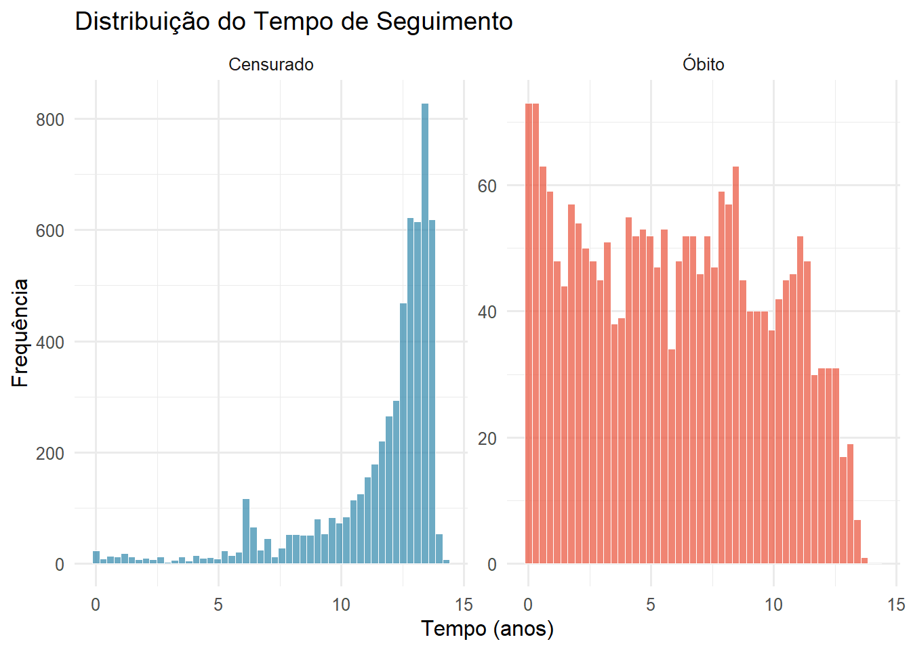

Censurados concentram-se em tempos longos (11–14 anos), padrão consistente com censura à direita não informativa — os indivíduos foram censurados por fim do estudo, não por razões relacionadas ao risco. Óbitos distribuem-se mais uniformemente ao longo de todo o período.

---

### Variáveis laboratoriais

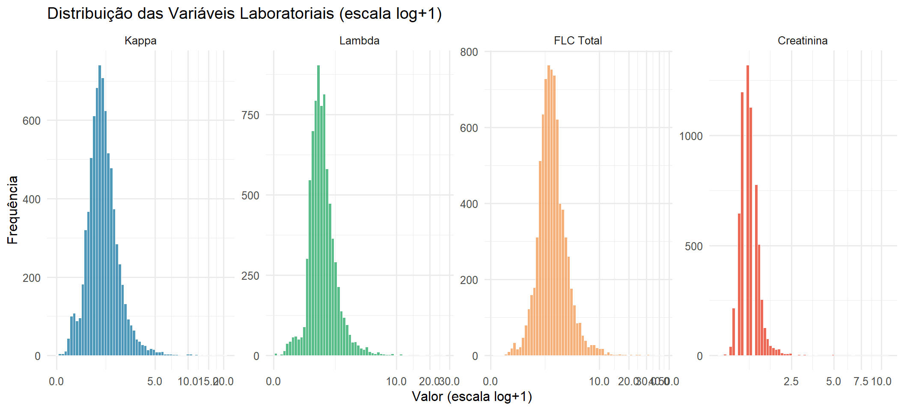

Distribuições fortemente assimétricas à direita, típicas de biomarcadores séricos. A escala logarítmica aproxima as distribuições da normalidade, justificando o uso de $\log(\text{creatinina})$ na modelagem e a interpretação dos coeficientes como efeitos multiplicativos sobre o risco.

---

### FLC por grupo e desfecho

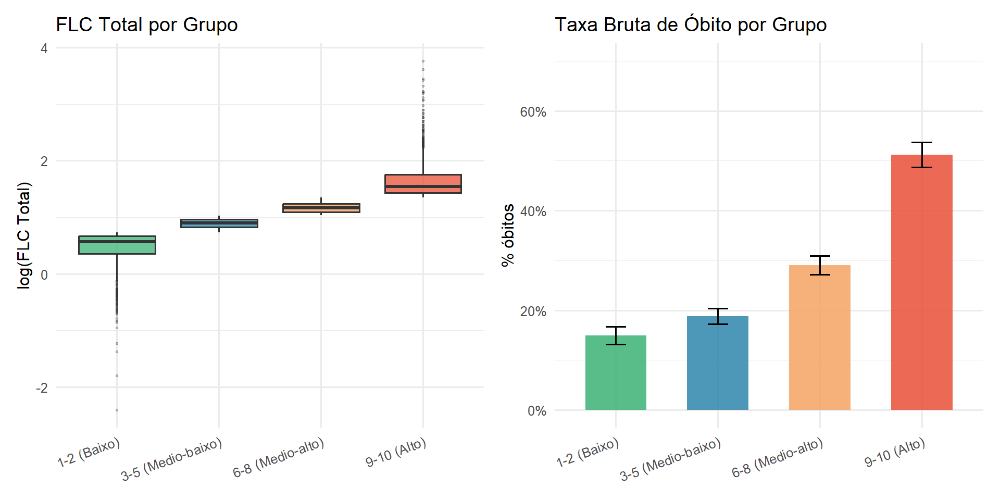

Relação dose a resposta clara já na análise univariada: a taxa bruta de óbito sobe monotonicamente de ~15% no grupo Baixo para ~51% no grupo Alto, com intervalos de confiança sem sobreposição entre grupos adjacentes.

---

### Causas de óbito por grupo de FLC

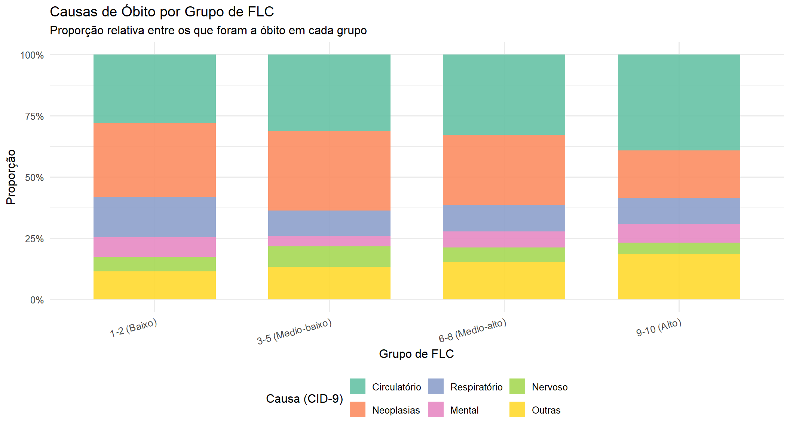

Doenças circulatórias dominam em todos os grupos. A proporção de neoplasias cresce com o nível de FLC, consistente com o papel da FLC como marcador de desregulação imunológica.

---

### Perfil de recrutamento e valores ausentes

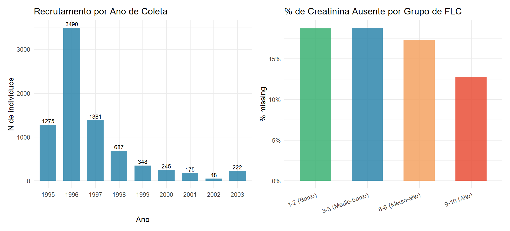

Os 1.350 valores ausentes de creatinina (~17%) concentram-se no grupo de FLC Baixo (25–30% de ausência), introduzindo potencial viés de seleção: a amostra modelada ($n = 6.521$) sobrerrepresenta indivíduos de maior risco relativo.

---

### Correlação entre variáveis contínuas

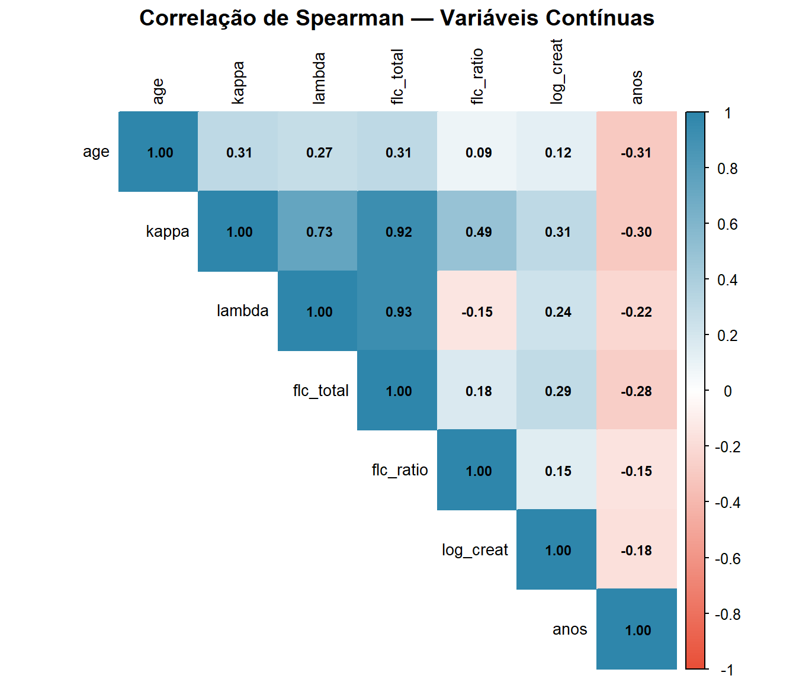

FLC total e creatinina apresentam correlação positiva moderada: rins com menor capacidade de filtração eliminam menos FLC, elevando seus níveis séricos. Esse mecanismo de confundimento reforça a necessidade de ajuste conjunto pelas duas variáveis.

---

## Estimadores Não Paramétricos

### Estimador de Kaplan-Meier

O estimador de Kaplan-Meier da função de sobrevivência é definido como o produto-limite:

$$\hat{S}(t) = \prod_{j:\,t_j \leq t} \left(1 - \frac{d_j}{n_j}\right)$$

onde $d_j$ é o número de eventos e $n_j$ o número em risco no instante $t_j$. O estimador é não paramétrico e lida naturalmente com censura à direita.

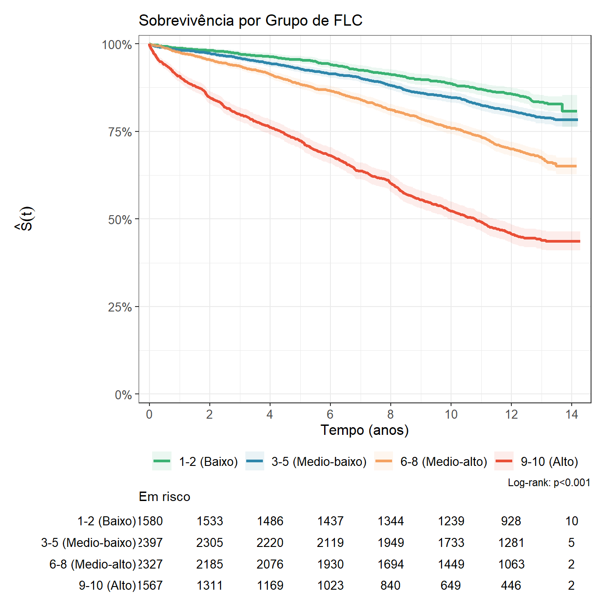

Separação visível desde o primeiro ano, aprofundando-se progressivamente até 14 anos. Ao final de 11 anos: $\hat{S} = 87\%$ no grupo Baixo vs. $49\%$ no grupo Alto — diferença de 38 pontos percentuais ($p < 0{,}001$, log-rank). Os grupos Baixo, Médio-baixo e Médio-alto não atingem a mediana de sobrevivência (mais de 50% sobreviveram ao período completo).

---

### Por sexo e faixa etária

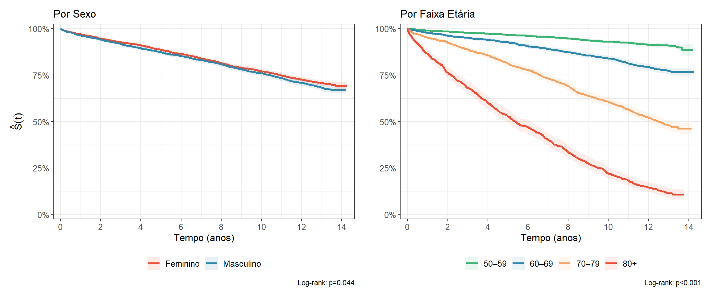

O efeito da faixa etária é o mais expressivo: grupo 80+ com $\hat{S}(t=5) \approx 50\%$ vs. $>95\%$ no grupo 50–59 anos — razão de risco implícita na ordem de 10:1, justificando plenamente o ajuste por idade.

---

### Estimador de Nelson-Aalen

O estimador de Nelson-Aalen da função de risco acumulada é:

$$\hat{\Lambda}(t) = \sum_{j:\,t_j \leq t} \frac{d_j}{n_j}$$

com relação $\hat{S}(t) \approx e^{-\hat{\Lambda}(t)}$. É preferível ao KM para visualizar a **forma** do hazard e diagnosticar distribuições paramétricas: $\hat{\Lambda}(t)$ linear em $t$ indica exponencial; linear em $\log(t)$ indica Weibull.

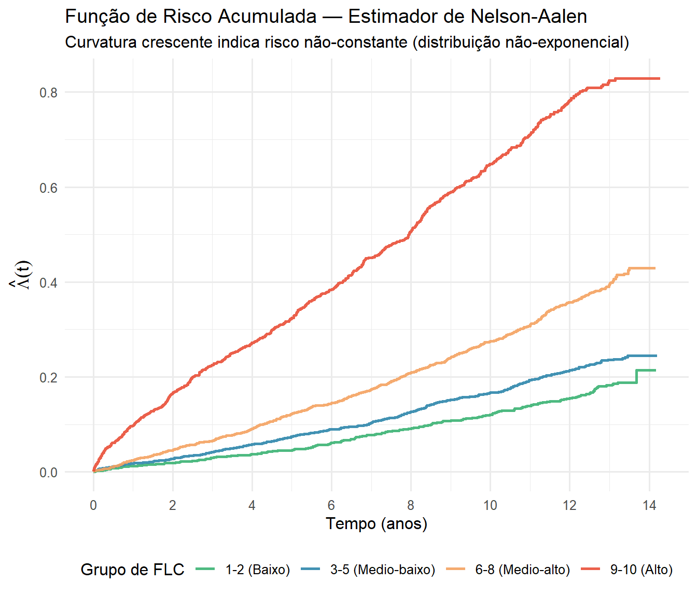

Curvatura crescente em todos os grupos descarta o modelo exponencial. Curvas aproximadamente paralelas em escala logarítmica sugerem proporcionalidade de riscos ao longo de quase todo o seguimento.

---

### Subgrupo MGUS

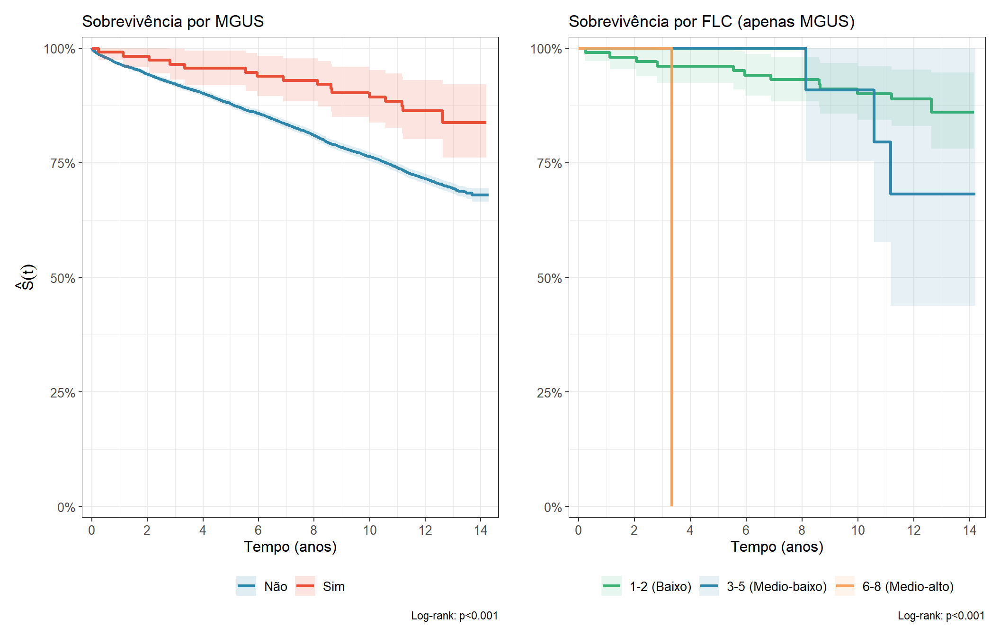

Indivíduos com MGUS apresentam sobrevivência surpreendentemente maior. Três hipóteses explicam o resultado: viés de detecção, confundimento por FLC elevada (critério diagnóstico do MGUS) e variabilidade amostral ($n = 115$). No Cox ajustado, o efeito do MGUS é não significativo ($p \approx 0{,}40$), apoiando a hipótese de confundimento.

---

## Modelagem

### Hazard suavizado (pré-seleção paramétrica)

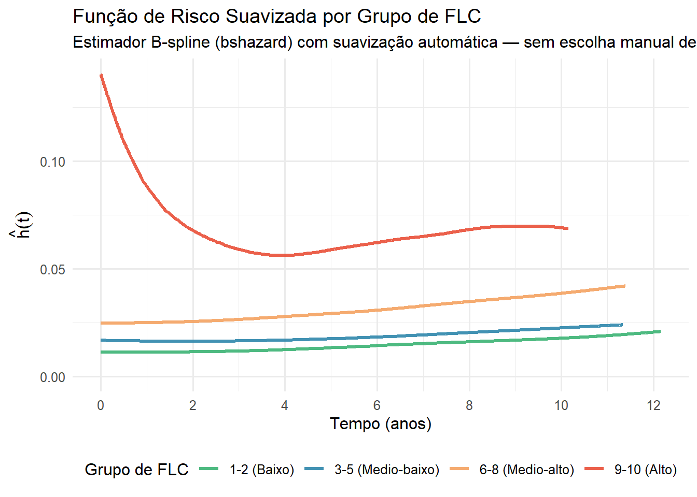

Estimador B-spline (Rebora et al. 2014) com suavização automática estimada pelos dados — sem escolha manual de bandwidth e sem efeito de borda. Os grupos Baixo, Médio-baixo e Médio-alto exibem risco crescente. O grupo Alto apresenta padrão em U (hazard elevado no início, mínimo ~4 anos, recuperação posterior), sugerindo heterogeneidade não observada como hipótese biológica.

---

### Gráficos de linearização (pré-ajuste)

Se a distribuição for adequada, a transformação correspondente de $\hat{S}(t)$ deve ser linear em $t$ ou $\log(t)$:

| Distribuição | Eixo X | Eixo Y |
|---|---|---|
| Exponencial | $t$ | $-\log\hat{S}(t)$ |
| Weibull | $\log t$ | $\log(-\log\hat{S}(t))$ |
| Log-normal | $\log t$ | $\Phi^{-1}(1 - \hat{S}(t))$ |
| Log-logística | $\log t$ | $\text{logit}(1 - \hat{S}(t))$ |

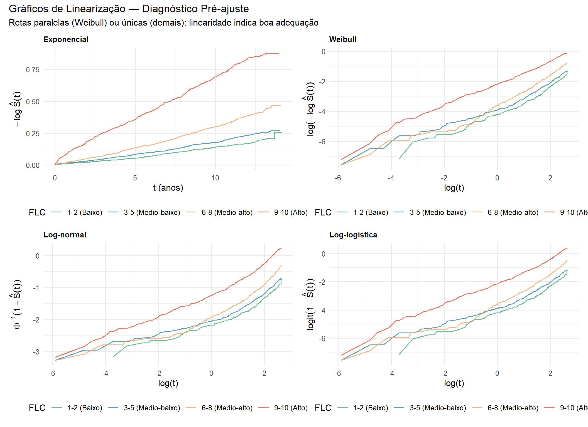

O painel Weibull exibe retas aproximadamente paralelas entre grupos, sugerindo boa adequação pré-ajuste. O exponencial é descartado pela curvatura acentuada. O Weibull é candidato plausível, a ser comparado formalmente com a gama generalizada.

---

### 1. Modelo de Cox semiparamétrico

O modelo de Cox especifica o hazard condicional como:

$$h(t \mid \mathbf{x}) = h_0(t)\exp\!\left(\beta_1 x_1 + \beta_2 x_2 + \cdots + \beta_p x_p\right)$$

onde $h_0(t)$ é o **hazard de base** (não paramétrico) e $\exp(\hat{\beta}_k)$ é a **razão de riscos** (HR): quanto o risco instantâneo muda por incremento unitário em $x_k$, mantidas as demais covariáveis constantes. O modelo é semiparamétrico pois não impõe forma distribucional a $h_0(t)$.

A seleção de covariáveis seguiu o procedimento de Collett (2003) em 4 passos (triagem univariada → backward → forward das descartadas → stepwise bidirecional), confirmada por `stepAIC` e TRV sequencial.

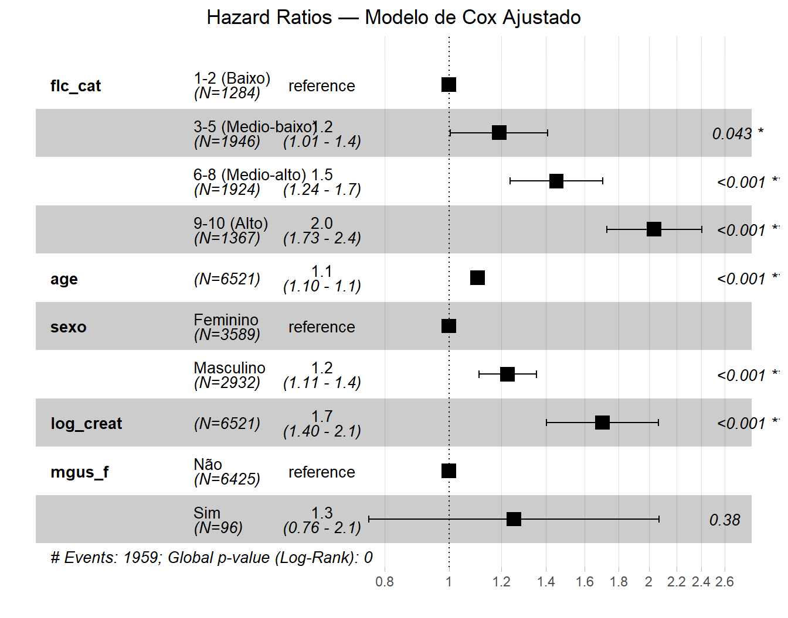

Gradiente monotônico e crescente da FLC após ajuste multivariado.

| Covariável | HR | IC 95% |
|---|---|---|
| FLC Alto vs. Baixo | **2,04** | 1,73 – 2,40 |
| FLC Médio-alto vs. Baixo | 1,45 | 1,24 – 1,71 |
| FLC Médio-baixo vs. Baixo | 1,19 | 1,01 – 1,41 |
| Idade (por ano) | 1,10 | 1,10 – 1,11 |
| Sexo masculino | 1,23 | 1,11 – 1,35 |
| log(Creatinina) | 1,70 | 1,40 – 2,07 |
| MGUS | 1,25 | 0,76 – 2,07 |

**Discriminação:** estatística $C$ de Harrell $= 0{,}788$ — definida como

$$C = P\!\left(\hat{\eta}_i > \hat{\eta}_j \mid T_i < T_j,\; T_i \text{ não censurado}\right)$$

onde $\hat{\eta}_i = \hat{\boldsymbol{\beta}}^\top \mathbf{x}_i$ é o preditor linear. Discriminação aceitável para modelo de mortalidade por todas as causas em população geral (limiar: $C \geq 0{,}7$).

---

### Diagnósticos do Cox

**Proporcionalidade de riscos (Schoenfeld)**

A suposição de PH exige que $h_i(t)/h_j(t)$ seja constante para todo $t$. O teste de Grambsch & Therneau (1994) baseia-se nos resíduos de Schoenfeld escalonados $\tilde{s}_{kj} = r_{kj}/\hat{V}(\hat{\beta}_k)$, que devem ser não correlacionados com o tempo sob $H_0$.

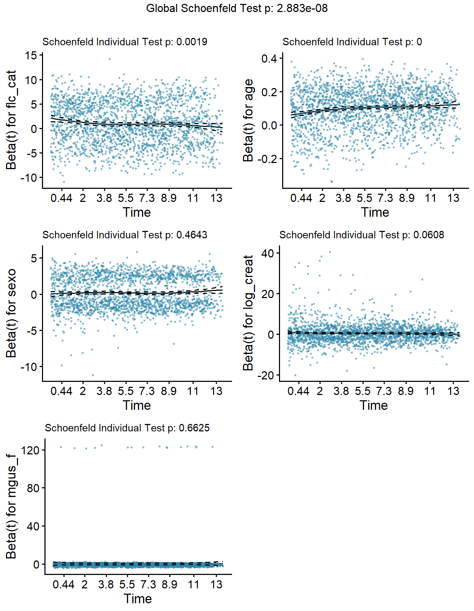

Teste global rejeita $H_0$ ($p = 2{,}88 \times 10^{-8}$), com violação individual em `flc_cat` e `age`. Com $n > 6.500$, o teste tem poder para detectar desvios clinicamente irrelevantes; o modelo é mantido com a limitação reportada.

---

**Forma funcional das contínuas (Martingale)**

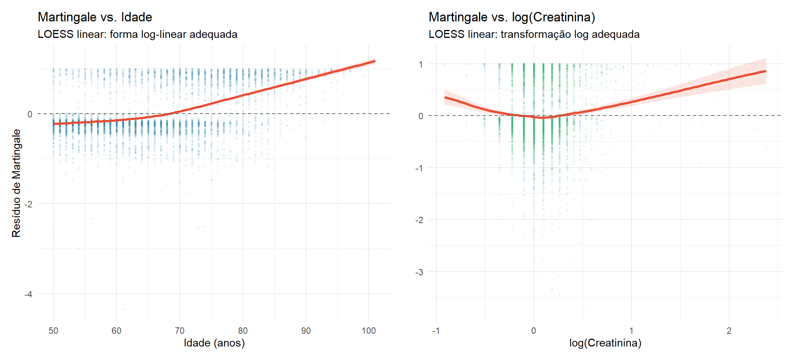

LOESS aproximadamente linear para idade e $\log(\text{creatinina})$, confirmando que a forma funcional linear na escala do log-risco é adequada — sem necessidade de termos polinomiais ou splines.

---

**Influência individual (dfbetas)**

O limiar de Belsley, Kuh & Welsch (1980) para identificação de observações influentes é $|d_i| > 2/\sqrt{n}$.

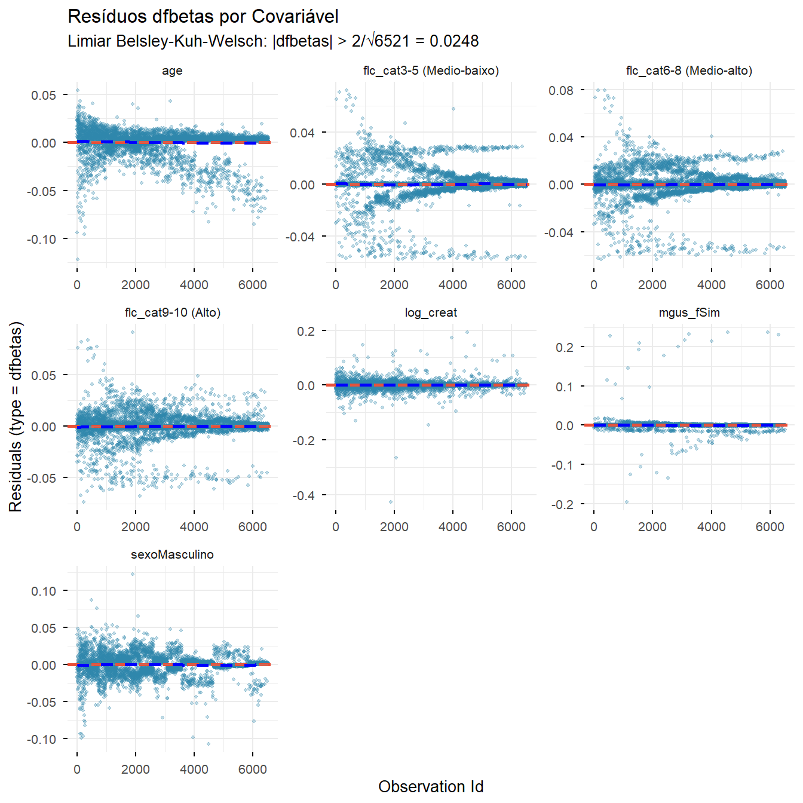

Proporção de observações influentes entre 0,9% e 6,9% — baixa para $n > 6.500$. Modelo estável.

---

**Outliers (Deviance)**

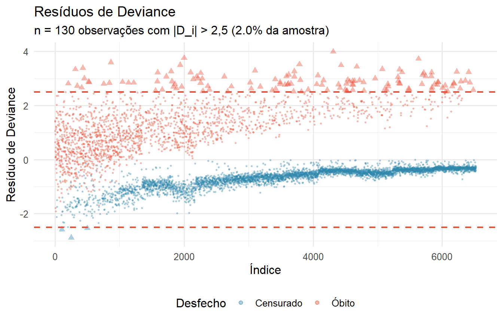

Resíduos concentrados em $[-2{,}5;\; 2{,}5]$. O padrão assimétrico por desfecho (censurados negativos, óbitos positivos) é estrutural ao estimador e não configura violação.

---

**Curvas ajustadas pelo modelo de Cox**

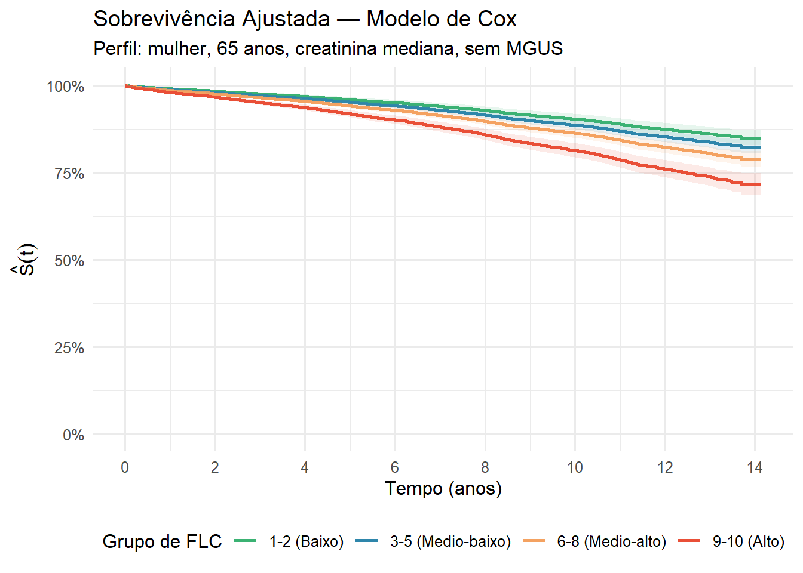

A separação entre grupos após ajuste é similar em magnitude às curvas brutas de Kaplan-Meier, confirmando que o efeito da FLC não é artefato de confundimento.

---

### 2. Modelos paramétricos AFT

Os modelos AFT (*Accelerated Failure Time*) especificam o tempo de sobrevivência como:

$$\log T = \mathbf{x}^\top\boldsymbol{\beta} + \sigma\varepsilon$$

onde $\varepsilon$ tem distribuição que depende da família escolhida. O coeficiente $\exp(\hat{\beta}_k)$ é interpretado como **razão de tempo**: quanto o tempo esperado de sobrevivência é multiplicado por um incremento unitário em $x_k$. Um valor $\exp(\hat{\beta}) < 1$ indica redução no tempo esperado de vida.

A **gama generalizada** é a família guarda-chuva com parâmetros $(\mu, \sigma, Q)$:

$$\text{Gama generalizada}(\mu, \sigma, Q) \supset \begin{cases} Q = 0 & \text{Log-normal} \\ Q = 1 & \text{Weibull} \\ Q = \sigma & \text{Gama} \\ Q = 1,\;\sigma = 1 & \text{Exponencial} \end{cases}$$

Como os modelos aninhados correspondem a pontos interiores do espaço paramétrico, a comparação via LRT segue $\chi^2(1)$ (Self & Liang 1987).

A **gama generalizada** foi selecionada (menor AIC; $\Delta$AIC $> 50$ para todos os demais). Os testes LRT rejeitam Weibull, log-normal e gama como simplificações ($p < 0{,}001$).

| Distribuição | AIC | $\Delta$AIC |
|---|---|---|
| **Gama generalizada** | **15.267,73** | **0,00** |
| Weibull | 15.318,69 | 50,96 |
| Gama | 15.330,44 | 62,71 |
| Exponencial | 15.334,89 | 67,16 |
| Log-logística | 15.523,47 | 255,74 |
| Log-normal | 15.932,97 | 665,24 |

Parâmetro $Q$ estimado: $\hat{Q} \approx 1{,}57$ (IC 95%: 1,38–1,75; não contém 0 nem 1, rejeitando formalmente log-normal e Weibull). O grupo Alto reduz o tempo esperado de sobrevivência em ~42% ($\exp(\hat{\beta}) \approx 0{,}58$).

---

### Verificação gráfica da gama generalizada (pós-ajuste)

A transformação $\text{sign}(y_W) \cdot |y_W|^{1/\hat{Q}}$, onde $y_W = \log(-\log\hat{S}(t))$, produz retas lineares se a gama generalizada for adequada.

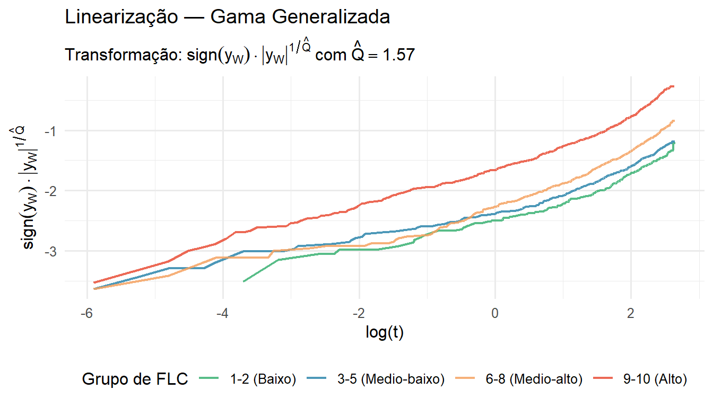

Retas aproximadamente lineares confirmam o bom ajuste. O padrão é visualmente similar ao Weibull, mas o IC de $\hat{Q}$ exclui $Q = 1$, rejeitando formalmente essa simplificação.

---

## Pacotes R utilizados

| Pacote | Função no trabalho |
|---|---|
| `survival` | KM, Nelson-Aalen, Cox, dados `flchain` |
| `flexsurv` | Modelos paramétricos AFT (gama generalizada, Weibull, etc.) |
| `bshazard` | Hazard suavizado por B-splines |
| `muhaz` | Hazard por kernel (referência) |
| `MASS` | `stepAIC` para seleção de covariáveis |
| `ggsurvfit` | Curvas KM/Nelson-Aalen com `ggplot2` |
| `survminer` | Diagnósticos do Cox (`ggcoxzph`, `ggforest`) |
| `gtsummary` | Tabelas descritivas e de modelos |
| `gt` | Tabelas com formatação e LaTeX |
| `tidyverse` | Manipulação e visualização |
| `patchwork` | Composição de gráficos em painéis |
| `broom` | Extração de resultados de modelos |
| `corrplot` | Matriz de correlação de Spearman |
| `scales` | Formatação de eixos |

---

## Arquivos

```
.
├── TrabalhoFinal_Sobrevivencia.qmd   # Documento-fonte (Quarto)
├── references.bib                    # 24 referências bibliográficas
├── figures/                          # Figuras geradas pelo render
│   ├── km-flc-1.png
│   ├── hazard-suavizado-1.png
│   ├── forest-plot-1.png
│   └── ...
├── index.html                        # HTML publicado no GitHub Pages
└── README.md
```

---

## Reprodução local

### Dependências R

```r
install.packages(c(
  "survival", "flexsurv", "muhaz", "bshazard",
  "MASS", "My.stepwise", "ggsurvfit", "survminer",
  "gtsummary", "gt", "tidyverse", "patchwork",
  "broom", "corrplot", "scales"
))
```

> **R:** ≥ 4.4.0 · **Quarto:** ≥ 1.4

### Renderização

```bash
quarto render TrabalhoFinal_Sobrevivencia.qmd --to html
```

Os dados `flchain` são carregados diretamente via `data(flchain, package = "survival")` — nenhum arquivo externo necessário.

---

## Referências principais

- Dispenzieri, A. et al. Use of nonclonal serum immunoglobulin free light chains to predict overall survival in the general population. *Mayo Clinic Proceedings*, 87(6), 517–523, 2012.
- Kyle, R. A. et al. Prevalence of monoclonal gammopathy of undetermined significance. *New England Journal of Medicine*, 354(13), 1362–1369, 2006.
- Collett, D. *Modelling Survival Data in Medical Research*. 2. ed. CRC Press, 2003.
- Therneau, T. M.; Grambsch, P. M. *Modeling Survival Data: Extending the Cox Model*. Springer, 2000.
- Jackson, C. flexsurv: A Platform for Parametric Survival Modeling in R. *Journal of Statistical Software*, 70(8), 2016.
- Rebora, P.; Salim, A.; Reilly, M. bshazard: A Flexible Tool for Nonparametric Smoothing of the Hazard Function. *The R Journal*, 6(2), 114–122, 2014.
- Colosimo, E. A.; Giolo, S. R. *Análise de Sobrevivência Aplicada*. Edgard Blücher, 2006.
- Burnham, K. P.; Anderson, D. R. *Model Selection and Multimodel Inference*. 2. ed. Springer, 2002.
- Self, S. G.; Liang, K.-Y. Asymptotic properties of maximum likelihood estimators and likelihood ratio tests under nonstandard conditions. *JASA*, 82(398), 605–610, 1987.